## Y8D00-CPU

### 介绍
  Minecraft实现基于自创指令集机构设计CPU
  该仓库提供 : 参考YDD_ISA_1.0.1指令集架构设计的CPU内核,及其基于该内核设计计算机系统等开发项目.此外提供了计算机编程编译烧写工具(所有硬件都在Java版Minecraft中实现,软件均为python程序,请确保准备py编程语言编译环境和IDE工具以及基于SpigotMC服务器).
### 规格：
  - 哈佛架构
  - 单周期CPU
  - 主频0.21Hz
  - 数据位宽8位
  - 指令位宽24位
  - 双总线接口

### 使用说明
#### 1.放置计算机
  解压computer.zip,使用WorldDedit模组放置comuputer.schem蓝图<br>
  ```
        //schem load computer.schem
        //paste
  ```
此外提供了该单个处理器蓝图，后续将会补充该CPU具体硬件细节以便感兴趣的读者对其进行开发.
#### 2.查看计算机硬件
  计算机放置完成后找到图片中所标注位置:(图中"电"改为"点")
  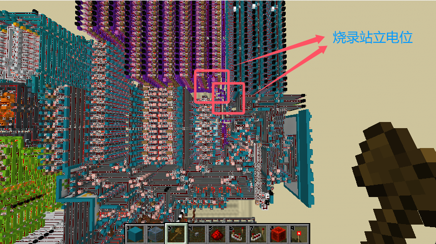
  -顺序执行ROM烧录位置，如下图所示(对映programming/rom_1):
  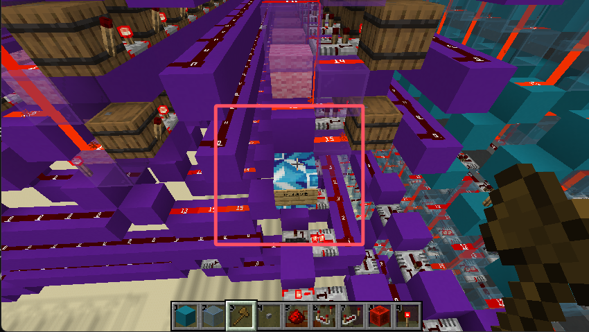
  -可寻址跳转ROM烧录位置，如下图所示(对应programming/rom_2):
  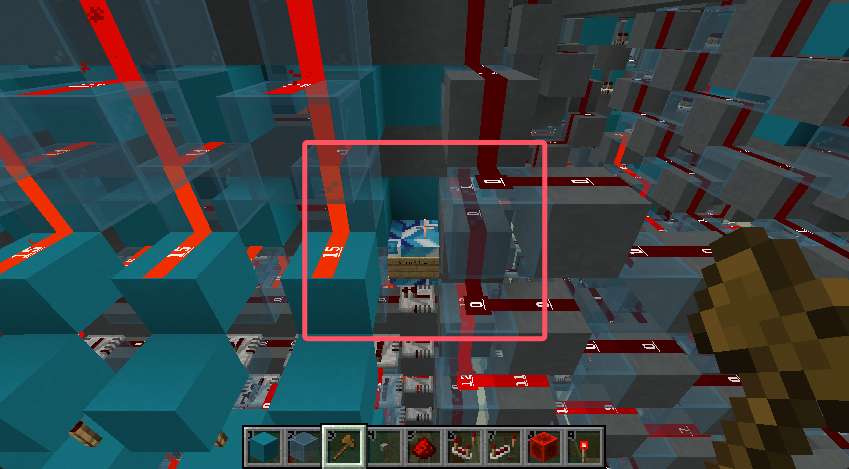
   站立到蓝色方块上后，执行烧录程序，即可对其ROM的烧录.
   烧录完毕后旁边可看到白色的房间嵌在计算机内，该房间负责对整个计算机的启动关闭以及运行模式进行控制.  
  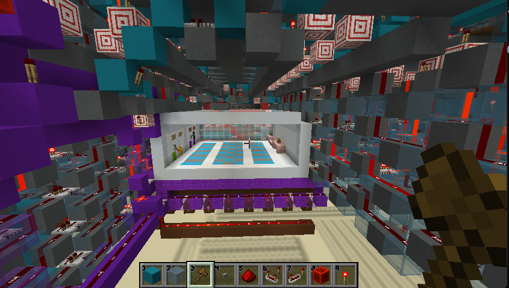
   下图为控制说明:
  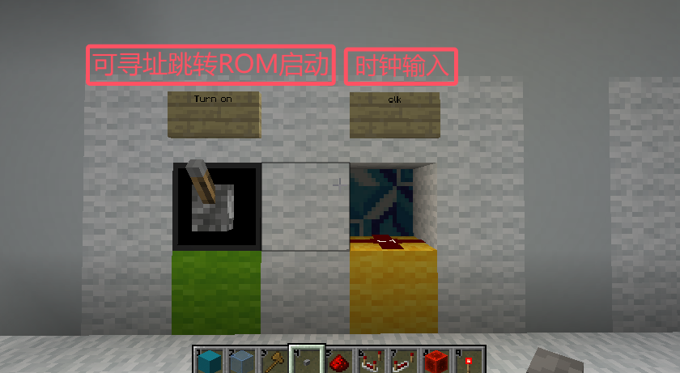
  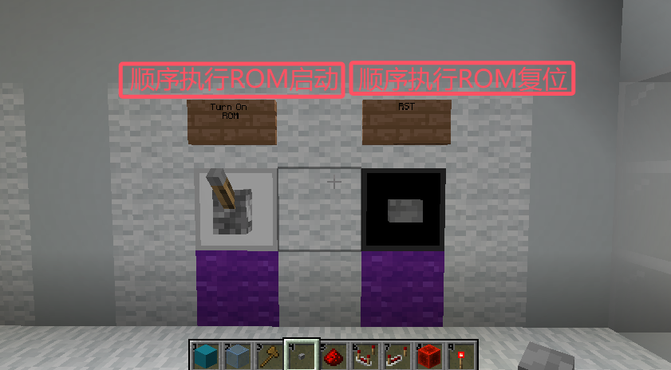
#### 3. 启动计算机
    确保程序烧录好后，需要配置计算机启动模式：可寻址跳转ROM启动/顺序执行ROM启动，若为顺序执行ROM作为启动模式需将ROM进行一次复位.
    配置好启动模式后来到如图中标注地方:
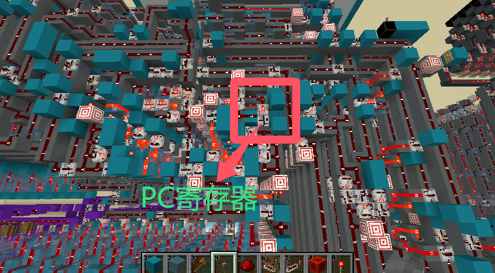
    将PC寄存器中的每一位值手动置0.
    回到控制房间找到时钟输入口，并接入如下图所示标准时钟源:
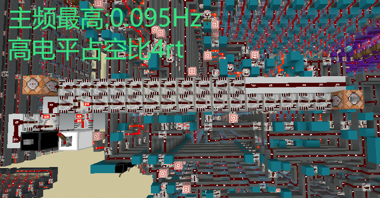
    接入时钟源并确保时钟工作即可正常启动计算机,关闭时钟源即可使计算机停止工作,按照上述配置方式即可再次启动计算机.
#### 汇编器使用说明
    汇编源代码在/ydd_isa_1.0.1_asm下,使用IDE打开该根目录并找到main.py设置汇编编译源文件和编译目标文件后即可运行程序进行编译.
    如下图所示:
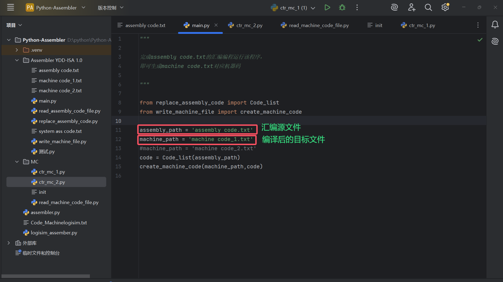
    提供了三个汇编示例程序/bresenham(slope小于等于1）.txt /弹方块.txt /字符显示函数.txt
    此外字符显示函数中的前三个指令立即数分别传入字符ASCII码、X偏移量、Y偏移量,如下图所示:
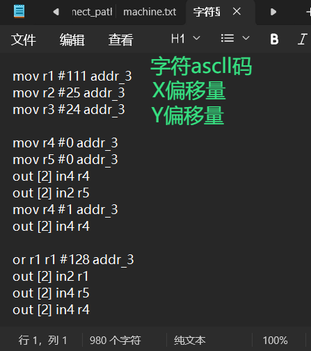
#### 烧录器使用说明
    该烧录器使用到了mcpy库，需要在SpigotMC服务器中实现烧录.
    使用烧录其工具前将服务器插件文件中树莓派插件/raspberryjuice-1.12.jar
    烧录程序中设置好烧录文件和玩家名称,如下图顺序执行ROM烧写程序为例:
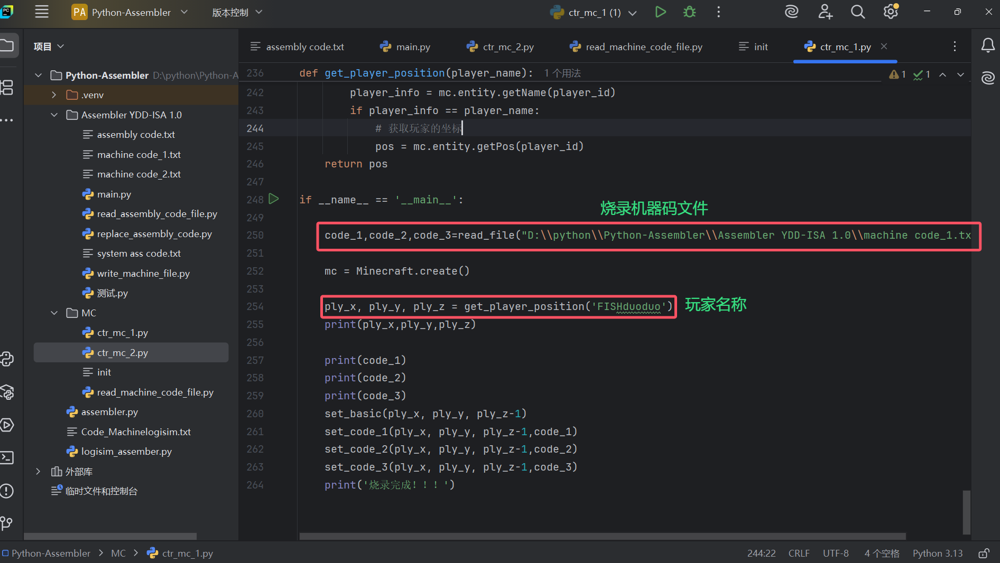
    设置完成站在要求指定的方块上运行程序即可完成机器码的烧录.    


By:FISHduoduo
    
